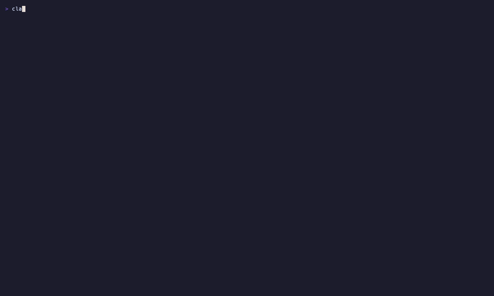

# Dependency Bouncer




A Claude Code mod that vets packages before they install.

It watches install commands: `npm i/install/add/ci/exec/update`, `npx`, `yarn add`, `yarn workspace … add`, `pnpm add/dlx`, `bun add/x`, `npm create`, `pip install` (including `-r` files and their includes), `uv add`, `uv pip install`, `uv tool install`, `uvx`, `poetry add`, `uv sync`, `poetry install` and `pipx`. The command parser handles:

- global flags before the verb, and `--no-binary`, `--find-links` and `--no-index`
- wrappers (`sudo`, `env`, `corepack`) and venv paths (`.venv/bin/pip`)
- `bash -c`/`-lc`, `eval`, backticks and `$(…)`
- subshells, with their own `cd`, and `if … then` blocks
- shell variables and backslash line continuations

A bare `npm install` checks the version the lockfile pins for each dependency that isn't already installed at that version. `npm ci` checks every dependency, because it wipes `node_modules` and runs every install script again.

It also watches edits to `package.json` (dependencies, `overrides`, `resolutions`, `npm:` aliases, lifecycle scripts), `requirements*.txt`, `requirements/*.txt` and `pyproject.toml` (PEP 621, dependency groups, Poetry tables). New entries are checked, and so are existing entries whose version or source changed.

Each package is checked against the npm or PyPI registry, at the release that would actually install. npm ranges resolve the way npm resolves them (`latest` first, then the highest match, with npm's pre-release rules). PyPI specifiers follow PEP 440.

| Signal | Result |
|---|---|
| Package doesn't exist (likely hallucinated) | **blocked** |
| The requested version or tag isn't published | **blocked** |
| One typo (swaps included) from a popular package or scope, with under 50k weekly downloads | **blocked** (possible typosquat) |
| Popular name whose code comes from a git URL or tarball instead | **blocked** |
| First published under 30 days ago **and** runs install scripts (npm), or would build from source (PyPI: no wheel, or `--no-binary`) | **blocked** |
| New, under 1,000 weekly downloads, install scripts, deprecated, no wheels, or a git/URL source | allowed, with a caution for the model and a toast |
| `--extra-index-url` or `--find-links` in play (dependency confusion risk) | caution |
| A requirements file fetched from a URL | **blocked** |
| A custom registry (`--registry`, `--index-url`, `--no-index`, env vars, requirements-file index options, project or `~/.npmrc`) | caution only; the public registry isn't consulted, so private package names don't leak and can't false-positive |
| The project already has a package that does the same job (e.g. adding `moment` alongside `date-fns`) | hint |
| A new `preinstall`/`install`/`postinstall`/`prepare` script in `package.json` | caution |

Well-known packages pass without a network call. Lookups run in parallel against one 5-second deadline, and whatever has answered by then still counts. Results are cached for 15 minutes. If the registry is unreachable, the install goes ahead with a warning, unless the name is also one typo away from a popular package. Text from the registry, such as deprecation notes, is quoted and marked untrusted before the model sees it.

`/allow-dep <name>` allows a blocked package for the rest of the session. It normalizes PyPI names the way PyPI does. `/allow-dep` with no name shows the last check.

Not covered:

- **Transitive dependencies.** Only the packages a call names directly are checked, so a clean result for `npm i some-cli` says nothing about its dependency tree.
- **Other lockfiles and workspaces.** yarn, pnpm and bun lockfiles, `uv.lock` and `poetry.lock` aren't read, and neither are workspace member manifests.
- **pip details.** Constraints files, `pip.conf`, `requires_python` and wheel-compatibility selection aren't modelled.
- **Some shell forms.** Script files run with `bash x.sh` or `source`, and `for` loops, aren't followed.
- **Earlier tool calls.** A `cd` made in a previous tool call isn't tracked.
- **Heredoc manifests.** A manifest written by a shell heredoc isn't caught when it's written, though a later bare `npm install` catches it.

## Install

```
/plugin marketplace add ccdwyer/claude-mods
/plugin install dependency-bouncer@ccdwyer-mods
/reload-plugins
```

## Develop

```
claude plugin validate .
claude plugin test .
```
